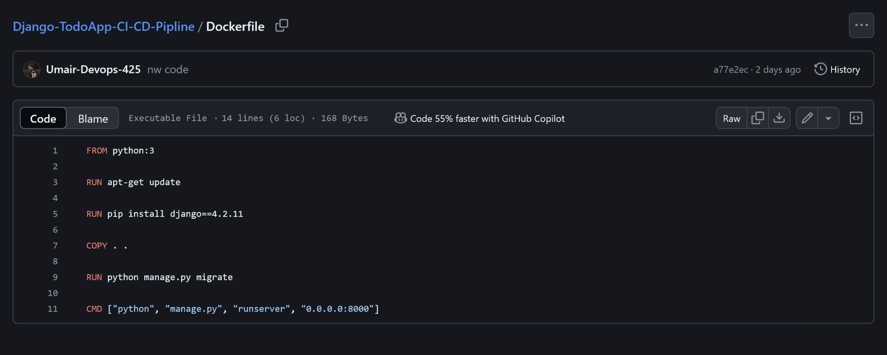

# Deployment Using Jenkins CI/CD Pipeline 

This project provides a step-by-step guide to deploy a sample code from a GitHub repository using Jenkins and Docker. The goal is to automate the deployment process, making it easier to build, test, and deploy applications using Amazon Web Server(AWS).

## Prerequisites

Make sure you have the following installed on your Amazon Web Server (AWS):

* Git : [Git](https://git-scm.com/)
* Docker : [Docker](https://docs.docker.com/get-docker/)
* Jenkins : [jenkins](https://www.jenkins.io/doc/book/installing/)

## Getting Started

### Making a Directory

``` 
mkdir django-TodoApp 
```

### Clone the repository

Cloning a repository in a Directory (django-TodoApp) in AWS EC2 instance

```
git clone https://github.com/shreys7/django-todo.git
```

### DockerFile

Creating a DockerFile to automate Deployment



### Setting Up Jenkins

1. Start Jenkins : 
   * If you have Jenkins installed, start the Jenkins server.