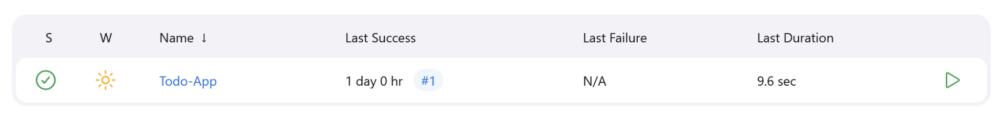

# Django TodoApp deployed using Jenkins CI/CD Pipeline

This project provides a step-by-step guide to deploy a sample code from a GitHub repository using Jenkins and Docker. The goal is to automate the deployment process, making it easier to build, test, and deploy applications using Amazon Web Server(AWS).

## Prerequisites

Make sure you have the following installed on your Amazon Web Server (AWS):

* Git : [Git](https://git-scm.com/)
* Docker : [Docker](https://docs.docker.com/get-docker/)
* Jenkins : [jenkins](https://www.jenkins.io/doc/book/installing/)

## Getting Started

### Making a Directory

``` 
mkdir django-TodoApp 
```

### Clone the repository

Cloning a repository in a Directory (django-TodoApp) in AWS EC2 instance

```
git clone https://github.com/shreys7/django-todo.git
```

### DockerFile

Creating a DockerFile to automate Deployment


### Setting Up Jenkins

<<<<<<< HEAD
1. Start Jenkins : 
   * If you have Jenkins installed, start the Jenkins server.
   * Access Jenkins via your browser at `http://localhost:8080`.

2. Install Required Plugins :
   * Go to `Manage Jenkins` > `Manage Plugins`.
   * Install the following plugins (if not already installed):
     - Docker Pipeline
     - GitHub Integration

3. Create a Job in Jenkins Dashboard :
   * Create Freestyle-Pipeline
   * Build Steps -> Execute Shell
   ``` 
   sudo docker build . -t todo-app
   sudo docker run -p 8000:8000 -d todo-app
   ```
   

4. Check That is Todo-App is running on server `http:// localhost:8000`.


        
